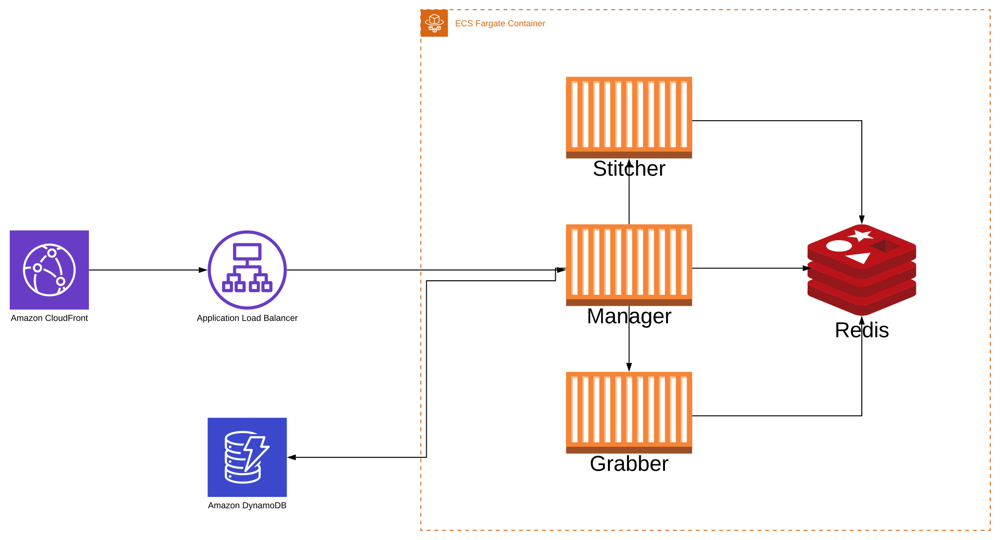

# Cloud Multiview

## Prerequisites

* Terraform
* AWS account and credentials available to Terraform

## Deploy

1) Create 3 ECR repositories called
    * multiview_ffmpeg_service
    * multiview_multiview_manager
    * multiview_object_manager
2) Edit `build-all-containers.sh` and replace `AWS_ACCOUNT_ID` and `AWS_REGION`
3) Edit `terraform/variables.tf`
    * Update vpc to your desired VPC id, e.g. `vpc-abcdef`
    * Optionally change *_docker variables to a different container, however these defaults will work if you follow the guide
4) Run the following
    ```
        ./build-all-containers.sh
        cd terraform
        terraform init
        terraform apply
    ```

## How to use

Find the new CloudFront distribution domain name and use it for all requests, for this document I'll refer to it as `https://xyz.cloudfront.net/`

There are two main endpoints, the /create and /play endpoint

For creating a new multiview, you'll need to hit the /create endpoint

    https://xyz.cloudfront.net/create?urls=abc&urls=def

(Note, any valid UrlDsl can be substituted as a value in any `urls` query param)

Upon doing this you'll be redirected to the /play endpoint with a url similar to
    
    https://xyz.cloudfront.net/play/a4b1761e9dse1bff38ff5132f6d23030/index.m3u8

This URL can be distributed and used by anyone to view the multiview HLS stream and used indefinitely into the future, there is no need to call /create again

When you first hit this endpoint for a stream you'll be served a blank manifest while the stream starts in the background, this process can take up to 30 seconds so regular refreshes until a segment appears, is recommended

## UrlDsl

UrlDsl is a custom library for representing multiple streams with similar formatting and enabling rendering options. Each list of values is encapsulated in `{` and `}`, separated by commas. After each list of values options can be specified using `[` and `]`

Valid options are

* m
    * The multiplicative modifier multiplies this group by all other groups, e.g. `{a,b,c}[m]{1,2}[m]` becomes `a1 b1 c1 a2 b2 c3`. By default all groups are multiplicative
* e
    * The element-wise modifier chains element-wise elements together, e.g. `{a,b}[e]{1,2}[e] `becomes `a1 b2`
        * All groups with this modifier must contain the same number of elements
        * Queries with multiple group types work, e.g. {a,b,c}[e]{-a,-b}[m]{1,2,3}[e] turns to 
            * a-a1
            * a-b1
            * b-a2
            * b-b2
            * c-a3
            * c-b3
* n
    * Includes the value of this group in the name of stream rendered on the multiview
* nc
    * Capitalise before rendering in name
* nl
    * Lowercase before rendering in name
* npre
    * Prepend to valid before rendering in name, e.g. `{A,B}[n,npre=Stream-]` prints `Stream-A` and `Stream-B`
* npost
    * Same as above but after, e.g. `{A,B}[n,npost=-SYD]` prints `A-SYD` and `B-SYD`
    * npre and npost can be used simulataneously
* norder
    * Affects the order of the way name values are concatenated, e.g. `{A,B}[n,norder=1]{Stream-}[n,norder=0]` becomes `Stream-A` and `Stream-B` when rendered
* dnr
    * Do not render this group's values in the stream *URL*, e.g. `{My Stream!}[n,dnr]https://mystream.xyz/` has the name `My Stream!` and the URL `https://mystream.xyz/`

Examples:

Creates a mosaic with 18 streams with titles PRI-MEL1, PRI-SYD3 etc

https://xyz.cloudfront.net/create?urls=https://mystream.xyz/{MEL,SYD,BRI,ADE,PER,ABC}[n,npre=PRI-]{1,2,3}[n]/master.m3u8

* https://mystream.xyz/MEL1/master.m3u8
* https://mystream.xyz/MEL2/master.m3u8
* https://mystream.xyz/MEL3/master.m3u8
* https://mystream.xyz/SYD1/master.m3u8
* https://mystream.xyz/SYD2/master.m3u8
* Etc


## Stream management

When a stream is inactive for 5 minutes, any resources which are not being used by at least 1 other multiview will be killed and the underlying cluster scaled to accommodate

When a cold stream (that is one which becomes inactive, or never became active) starts several resources are created. A ffmpeg instance for the multiview itself and for all child streams being fed in must be started, given segments lengths are 10 seconds the stream may take up to 20-30 seconds before all streams are visible in the multiview (or even longer if the cluster needs to be scaled to accommodate)

Examples:
```
    Multiview for streams A,B,C,D requested
    FFMPEG<A,B,C,D> started
    FFMPEG<A> started
    FFMPEG<B> started
    FFMPEG<C> started
    FFMPEG<D> started
    Multiview for streams A,B,C,D becomes inactive
    FFMPEG<A,B,C,D> killed
    FFMPEG<A> killed
    FFMPEG<B> killed
    FFMPEG<C> killed
    FFMPEG<D> killed
```
```
    Multiview for streams A,B,C,D requested
    FFMPEG<A,B,C,D> started
    FFMPEG<A> started
    FFMPEG<B> started
    FFMPEG<C> started
    FFMPEG<D> started

    Multiview for streams C,D,E,F requested
    FFMPEG<C,D,E,F> started
    FFMPEG<C> started
    FFMPEG<D> started
    FFMPEG<E> started
    FFMPEG<F> started

    Multiview for streams A,B,C,D becomes inactive
    FFMPEG<A,B,C,D> killed
    FFMPEG<A> killed
    FFMPEG<B> killed
    FFMPEG<C> *NOT* killed
    FFMPEG<D> *NOT* killed

    Multiview for streams C,D,E,F becomes inactive
    FFMPEG<C,D,E,F> killed
    FFMPEG<C> killed
    FFMPEG<D> killed
    FFMPEG<E> killed
    FFMPEG<F> killed
```

## Infrastructure



### Manager

The manager receives both requests to create multiviews, serve manifests (via /play) and also serve raw blobs (segment files). The manager calculates what resources a multiview needs, the size of multiview and more

The manager then compares what streams it knows is running against what needs to be running and fires requests to the Stitchers and Grabbers to start the necessary ffmpeg instances

When a create request is received, the manager stores the request details in DynamoDB and generates a unique fingerprint for that configuration. This fingerprint is what is seen in the URL users are redirected

The manager also updates the dead man switch on each of these resources every time a manifest request is received, effectively marking a stream as 'active'. DynamoDB is queried to discover which resources are needed to run (the config is also cached in Redis to reduce Dynamo reads)

### Stitcher

The stitcher combines all of the frames from child streams into the final multiview. These frames are pulled from Redis

The stitcher also generates the segment files and manifests which are stored in Redis

The stitcher's code is identical to the grabber, except the concurrency limit is lower as it tends to be a very intensive process

### Grabber

The grabbers pull frames for streams and store them in Redis to be picked up by stitchers

### Redis

Redis is used for storing manifests, segments, stream frames, dead man switches and almost anything else you can think of. Redis was chosen over S3 on consistency and cost considerations

A multiview running 24x7 at 5 fps for 16 streams would require ~210240000 PutObject requests just from frames. At $0.0055 / 1000 requests this would cost $1,156.32. Not ideal. With Redis, we pay only for the potential inter-zone egress costs which are substantially less. If we arbitrarily assume each frame is 4kb, that'd only cost ~$8.50 for inserting into Redis

The other issue with S3 is the eventual consistency model which is not suitable for this project.

### The object manager sidecar

Each of the above containers uses a sidecar called the object manager sidecar for interacting with Redis for storing and retrieving blob data, including frames, segments and manifests

### AWS Fargate and AWS Fargate Spot

All containers run on AWS Fargate, all Grabbers run on AWS Fargate Spot

### Why separate multiview and pulling streams? 

If a stream is dead and an input into ffmpeg the multiview will die, not ideal for a monitoring solution. In this solution after 5 seconds, the last frame will be replaced with a red cloud and a cross through it. This also allows us to deduplicate resources, i.e. two multiviews which both require the same stream will only create one 'Grabber' instance rather than two